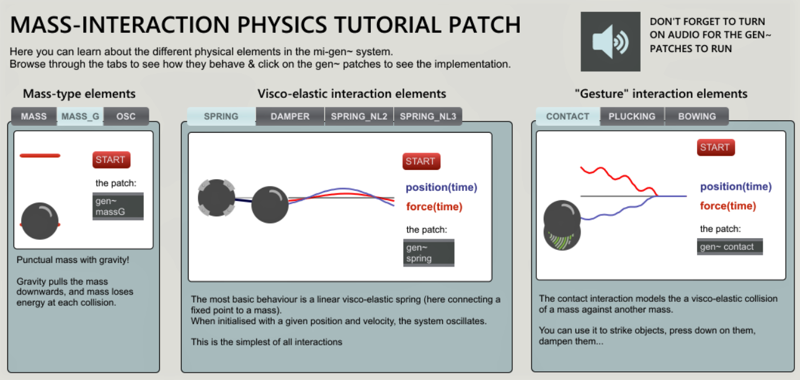
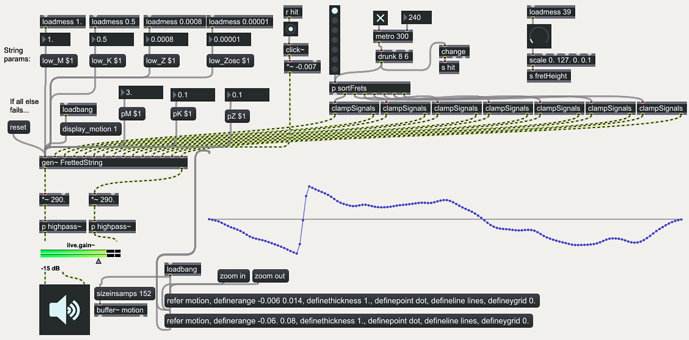

# mi-gen
Mass-Interaction Sound Synthesis Toolbox for Max/MSP's gen~

**mi-gen** is a mass-interaction physical modelling toolbox for the Max/MSP patching environment.
It allows coding and simulating virtual physical objects, modelled as networks of masses and interactions (springs, dampers, conditional contacts, etc.), directly within gen~'s *codebox* system.

## Getting Started

Clone or download the github repository and place the **mi-gen** folder in the Max/MSP's package folder (in Windows: {path-to-documents}/Max[7/8]/Packages).

## The Tutorial Patch

Once you've placed the package in Max's package folder and launched Max, head over to the "extras" tab: you should find an ***mi-gen~ Tutorial Patch***. Open the 00 - MI_Tutorial and - tadaaaaa - get to know which physical elements compose mi-gen~, what they do and how you can use codebox to create models with them !

## Running the examples

The examples are in the "examples" subfolder. There are several, demonstrating various virtual instruments and interactions (plucked and bowed strings, meshes, polyphonic instruments, etc.). They are always composed of a patch file, a gendsp file containing the model, and generally a .mdl file, corresponding to a model description.

Each patch deals with parameters, real-time control and visualisation in its own way, we encourage you to browse through them to see what's possible.

## The MIMS Model Scripter

MIMS is a model scripting tool, built in Python, that can be used to create larger physical models (that would be a pain to code by hand directly in gen~).

It can be found on github at the following address:  [MIMS](https://github.com/mi-creative/MIMS)

## Documentation

Documentation outside of the actual examples and tutorial patches is sparse for now but do not fear - we'll be adding more as we go along!

## Authors

This project was developped by James Leonard.

For more info, see: www.mi-creative.eu

## License

This project is licensed under the GNU GENERAL PUBLIC LICENSE - see the [LICENSE](LICENSE) file for details

## Acknowledgments

This work implements mass-interaction physical modelling, a concept originally developped at ACROE - and now widely used in sound synthesis, haptic interaction and visual creation.
